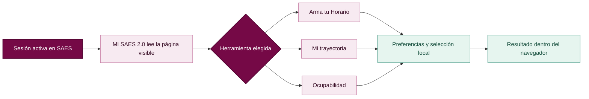
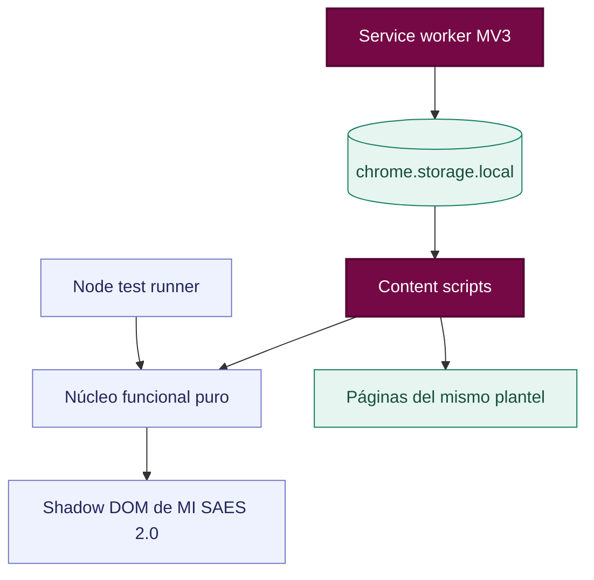

<p align="center">
  
</p>

<h1 align="center">MI SAES 2.0</h1>

<p align="center">
  Herramientas claras para consultar tu información académica y preparar un horario sin empalmes dentro del SAES del IPN.
</p>

<p align="center">
  
  
  
  
  
</p>

> [!IMPORTANT]
> MI SAES 2.0 es un proyecto independiente. No está afiliado, respaldado ni publicado oficialmente por el Instituto Politécnico Nacional.

<p align="center">
  <a href="#para-estudiantes">Para estudiantes</a> ·
  <a href="#para-desarrollo">Para desarrollo</a> ·
  <a href="#privacidad">Privacidad</a> ·
  <a href="#contribuir">Contribuir</a> ·
  <a href="#instalacion">Instalación</a>
</p>

<a id="para-estudiantes"></a>

## 👋 Para estudiantes

MI SAES 2.0 nace de una situación muy común. El SAES contiene la información que necesitas, pero comparar grupos, horarios y lugares puede tomar demasiado tiempo. La extensión organiza esos datos para que puedas decidir con calma y seguir teniendo el control.

## ¿Qué es MI SAES 2.0?

MI SAES 2.0 es una extensión para Chrome que añade una capa de herramientas sobre las páginas existentes del **Sistema de Administración Escolar (SAES)**. Usa tu sesión activa, interpreta únicamente la información que el sistema ya muestra y mantiene sus datos en `chrome.storage.local`.

No sustituye al SAES, no modifica sus registros y no delega decisiones académicas sensibles.

| Herramienta | ¿Qué permite hacer? |
|---|---|
| 🗓️ **Arma tu Horario** | Comparar grupos, mezclar periodos y turnos, detectar empalmes y generar hasta 30 horarios compatibles. |
| 📚 **Mi trayectoria** | Reunir y presentar de manera clara el avance académico que reportan las páginas oficiales del SAES. |
| 🪑 **Ocupabilidad** | Consultar cupo, inscritos y lugares disponibles. Si un grupo está lleno, sugiere alternativas compatibles. |
| 📅 **Exportación** | Crear un calendario `.ics` con fecha de inicio y duración configurables. |
| 🧭 **Horario preparado** | Conservar una selección como guía durante la reinscripción, sin marcar ni enviar materias automáticamente. |

## Arma tu Horario

La herramienta recorre bajo demanda los **turnos, planes y periodos** disponibles para la carrera seleccionada. Después une las filas complementarias de cada materia, incluso cuando un grupo tiene varios profesores, y rechaza combinaciones con traslapes reales por día e intervalo.

### Ejemplo

```text
Selección
├─ 6CM21 · Modulación Digital       · 07:00–08:30
├─ 6CV13 · Sistemas Operativos      · 09:00–10:30
└─ 7CV11 · Teoría de la Información · 18:30–20:00

Resultado
✓ 3 materias seleccionadas
✓ Turnos matutino y vespertino combinados
✓ 0 empalmes
✓ Listo para revisar o exportar como calendario
```

Los estados nunca dependen únicamente del color

- 🟢 **Compatible** se puede agregar sin interferir con la selección actual
- 🔴 **Conflicto** muestra materia, día e intervalo exacto del empalme
- 🟡 **Sin lugares** bloquea la generación y presenta alternativas cuando existen

## Mi trayectoria

En el inicio autenticado, MI SAES 2.0 puede presentar una lectura compacta del avance académico. La opción **Mostrar Mi trayectoria** permite activar u ocultar esta superficie sin eliminar los datos oficiales ni modificar el SAES.

La actualización puede conservar resultados parciales cuando alguna página no responde y siempre identifica qué fuente necesita reintentarse.

## Cómo funciona



<a id="para-desarrollo"></a>

## 🧑‍💻 Para personas desarrolladoras

MI SAES 2.0 está construido con JavaScript, HTML y CSS nativos. No hay framework, bundler ni código remoto. Esto mantiene pequeño el paquete y hace que cada permiso y cada flujo puedan auditarse directamente desde el repositorio.

### Arquitectura técnica

| Capa | Responsabilidad | Archivos principales |
|---|---|---|
| Ciclo de vida | Conserva ajustes durante instalaciones y actualizaciones. Registra el aviso de novedades de cada versión. | `src/background.js` |
| Núcleo funcional | Normaliza texto, interpreta horarios, detecta traslapes, genera combinaciones y exporta calendarios. | `src/shared/core.js` |
| Adaptadores SAES | Reconstruyen formularios ASP.NET Web Forms y hacen consultas secuenciales al mismo plantel. | `scanner.js` `occupancy.js` `trajectory.js` |
| Presentación | Inyecta una aplicación aislada mediante Shadow DOM sin rediseñar la página original. | `src/content/content.js` y archivos CSS |
| Superficies Chrome | Presentan el acceso rápido y los ajustes locales. | `popup/` y `options/` |
| Contratos automatizados | Cubren parsers, generación de horarios, estados parciales, privacidad y estructura del manifiesto. | `tests/` y `scripts/check.cjs` |



### Contrato del generador

El núcleo recibe alternativas ya normalizadas. Agrupa por materia y recorre una alternativa por grupo académico. Cada rama se descarta tan pronto aparece un traslape. El límite predeterminado es de 30 resultados y el límite defensivo interno es de 100.

```js
const schedules = core.generateScheduleCombinations(offerings, 30)

for (const schedule of schedules) {
  const conflicts = core.findScheduleConflicts(schedule.entries)
  console.assert(conflicts.length === 0)
}
```

### Lectura segura del SAES

El portal puede devolver una pantalla de acceso o un mensaje de error con estado HTTP 200. Por eso los adaptadores no confían únicamente en `response.ok`. También validan la estructura académica esperada antes de guardar resultados.

Las exploraciones de horarios usan pausas breves, un máximo de solicitudes y una señal `AbortController`. Así pueden detenerse sin dejar una operación larga ejecutándose en segundo plano.

### Estado local

Las claves se separan por origen y, cuando corresponde, por ruta. Esto evita mezclar catálogos de planteles o pantallas distintas.

```js
const plannerKey = `planner:${location.origin}:${location.pathname}`
const catalogKey = `catalog:${location.origin}:schedule`
const trajectoryKey = `trajectory:${location.origin}`
```

> [!NOTE]
> Los ejemplos técnicos muestran contratos reales del proyecto. Para cambiar un parser conviene agregar primero una página mínima en `tests/fixtures/` y convertir el caso observado en una prueba reproducible.

### Permisos mínimos

```json
{
  "permissions": ["storage"],
  "host_permissions": ["*://*.ipn.mx/*"]
}
```

- `storage` conserva preferencias, catálogos y horarios únicamente en Chrome.
- El acceso a `*.ipn.mx` permite funcionar en los distintos planteles y realizar consultas secuenciales de sólo lectura dentro de la sesión activa.
- No existen servidores de MI SAES ni dependencias remotas para ejecutar la extensión.

<a id="instalacion"></a>

## Instalación para desarrollo

### 1. Obtener el proyecto

```bash
git clone https://github.com/LeonardSF/MI-SAES-2.0.git
cd MI-SAES-2.0
```

### 2. Cargar la extensión

1. Abre `chrome://extensions`.
2. Activa **Modo de desarrollador**.
3. Pulsa **Cargar descomprimida**.
4. Selecciona la carpeta `MI-SAES-2.0`.
5. Abre el SAES de tu plantel y busca el acceso de **MI SAES 2.0**.

> Chrome no instala directamente un archivo ZIP en modo de desarrollador. Para probar un paquete debes descomprimirlo y cargar la carpeta resultante.

## Desarrollo y verificación

El proyecto utiliza JavaScript, HTML y CSS nativos. No necesita instalar dependencias npm ni ejecutar un proceso de compilación.

```bash
# Ejecuta todas las pruebas automatizadas
npm test

# Verifica manifiesto, permisos, CSP y sintaxis
npm run check

# Genera el ZIP para Chrome Web Store dentro de dist/
npm run package
```

### Estructura del repositorio

```text
MI-SAES-2.0/
├── assets/              # Iconos y tipografías locales
├── options/             # Configuración y privacidad
├── popup/               # Acceso rápido de la extensión
├── scripts/             # Verificación y empaquetado
├── src/
│   ├── content/         # Panel, horario, ocupabilidad y trayectoria
│   ├── shared/          # Lógica reutilizable y notas de versión
│   └── background.js    # Ciclo de vida y actualizaciones
├── tests/               # Pruebas y páginas de ejemplo
├── manifest.json
└── tokens.css           # Colores, tipografía y espaciado
```

<a id="privacidad"></a>

## Privacidad y seguridad

| MI SAES 2.0 sí hace | MI SAES 2.0 nunca hace |
|---|---|
| Procesa tablas y formularios visibles dentro del navegador. | Solicitar, leer o guardar tu contraseña o CAPTCHA. |
| Guarda preferencias y selecciones localmente. | Enviar información escolar a servidores propios. |
| Consulta secuencialmente páginas oficiales del mismo plantel. | Inscribir materias o enviar evaluaciones automáticamente. |
| Señala datos incompletos y sesiones terminadas. | Inventar calificaciones, cupos o estados académicos. |

Consulta la [Política de privacidad](PRIVACY.md) para conocer el detalle del procesamiento local y los permisos declarados.

## Alcance actual

- La página pública de ESIME Culhuacán fue utilizada como referencia durante el desarrollo.
- Las pantallas autenticadas pueden variar entre planteles. Los lectores evitan depender de un único diseño, pero necesitan validación con sesiones reales.
- Un horario generado es una propuesta de planeación, no una inscripción confirmada.
- La ocupabilidad puede cambiar. Confirma siempre los lugares y grupos directamente en el SAES.

## Atajos

| Acción | Atajo |
|---|---|
| Abrir o cerrar MI SAES 2.0 | <kbd>Alt</kbd> + <kbd>M</kbd> |

## Versiones y novedades

Chrome instala las versiones publicadas automáticamente después de la revisión de Chrome Web Store. MI SAES 2.0 muestra una sola vez las novedades incluidas en cada actualización y enlaza al historial completo del repositorio.

- [Ver todas las Releases](https://github.com/LeonardSF/MI-SAES-2.0/releases)
- [Reportar un problema](https://github.com/LeonardSF/MI-SAES-2.0/issues)

<a id="contribuir"></a>

## Contribuir

Las contribuciones son bienvenidas cuando respetan la privacidad estudiantil y mantienen al usuario al mando de cualquier acción académica.

- Lee la [guía para contribuir](CONTRIBUTING.md)
- Reporta vulnerabilidades mediante el proceso descrito en [Seguridad](SECURITY.md)
- Consulta la [licencia MIT](LICENSE)

## Identidad

El guinda `#750946` funciona como color principal y referencia visual de compatibilidad con el entorno académico del IPN. El icono y la marca **MI SAES 2.0** son propios del proyecto y no reproducen el escudo ni el logotipo institucional.
